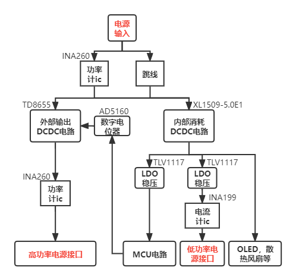

# W-Power

> 最近时不时会在一些项目中，遇到需要测量电压、电流和功耗等情况，手上现有的工具不太适合使用。再加上之前做的一个DCDC电源，功率比较小，用起来也比较捉急，于是就有了重新做一个DCDC电源模块的想法

### 一、功能描述

1. Buck DC-DC 降压，电压输入范围：8V - 36V，可调电压输出范围：1.25V - 32V，最高 12A 输出电流。
2. 能测量输入电压，输入电流，输出电压，输出电流，并计算功率，效率。
3. 能计算过去一段时间内，或从接入负载开始的瞬态峰值电流、瞬态峰值功率，以及平均电流。
4. 通过串口，与匿名上位机通信，显示电流、电压、功耗等波形。
5. 预留SWD调试接口，串口蓝牙接口等接口。（在考虑是否引出所有MCU未使用的引脚）

### 二、技术方案

由于设计模拟电路的经验不足，因此尽量减少模拟电路的使用。

功率计算部分由原先的电阻采样改为使用功率计 ic、电流计 ic。

### 三、芯片选型

|     型号     |       类型        |                             参数                             |
| :----------: | :---------------: | :----------------------------------------------------------: |
|    TD8655    | DC-DC Buck 控制器 | 输入：8.5V - 40V    输出：1.2V - 28V 开关：100khz - 300khz    封装：QFN20 |
|   TDM3436    |     N-MOSFET      | 漏源电压(Vdss)：40V    连续漏极电流(Id)：25A 功率(Pd)：2.7W    导通电阻(RDS(on)@Vgs,Id)：3.1mΩ@10V,25A |
| XL1509-5.0E1 |  DC-DC 电源芯片   | 输入：4.5V - 40V    输出：5V，3A 开关：150khz    封装：SOP-8 |
|   TLV1117    |  LDO 线性稳压器   |      输入：小于6V    输出：3.3V，1A 封装：SOT-223       |
|    INA260    |   功率检测芯片    | 感测电压范围：0V - 36V    持续电流：15A 感测电阻：2mΩ    兼容接口：I2C、SMBus    封装：SOP-16 |
|    INA199    |  电流传感放大器   |    共模范围：-0.3V - 26V    增益：50V/V 封装：SC70-6    |
|    AD5160    |    数字电位计     | 256位调节    端到端电阻：100kΩ 兼容接口：SPI    封装：SOT23-8 |

以上列表为主要芯片。

MCU 选用 STM32F405RGT6。

### 四、设计开发平台